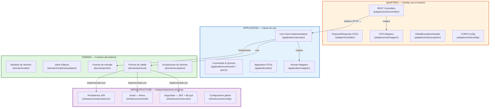
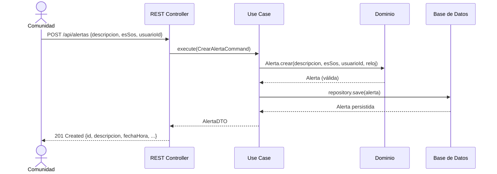

# Barrio Alerta — Backend

Sistema de alertas vecinales para la seguridad comunitaria. Un backend diseñado con conciencia social y ambiental, priorizando el bienestar de las comunidades sobre lógicas extractivistas.

---

## Propósito y contexto

Barrio Alerta nace de una necesidad real: **la seguridad ciudadana no puede ser un privilegio**. En comunidades donde la respuesta institucional es limitada, la solidaridad vecinal es el recurso más valioso. Este sistema permite a cualquier persona reportar incidentes en tiempo real, activar alertas S.O.S. y coordinar la respuesta comunitaria, todo desde una plataforma accesible, eficiente y ética.

El software no extrae datos para fines comerciales, no perfila usuarios, no vende atención. Es una herramienta al servicio de la comunidad, diseñada para minimizar su huella ecológica y maximizar su utilidad social.

---

## Arquitectura



### Flujo de una petición



### Principios de diseño

| Principio | Implementación |
|-----------|---------------|
| **Modularidad** | Cuatro capas con responsabilidades claras y dependencias unidireccionales. El dominio no sabe de HTTP, ni de bases de datos, ni de Spring. |
| **Bajo acoplamiento** | Las capas se comunican mediante interfaces (puertos). Cambiar la base de datos, el proveedor de email o el algoritmo de JWT no afecta al dominio ni a los casos de uso. |
| **Alta cohesión** | Cada capa hace una sola cosa: el dominio modela, la aplicación orquesta, la infraestructura implementa tecnología, los adapters traducen HTTP. |
| **Sostenibilidad** | El diseño permite reemplazar componentes pesados por alternativas ligeras sin reescribir lógica de negocio. |

### Estructura de paquetes

```
com.alertabarrio/
├── domain/                          # Corazón del sistema
│   ├── model/                       # Entidades y value objects
│   ├── exception/                   # Excepciones de dominio
│   └── port/                        # Contratos (interfaces)
│       ├── in/                      # Puertos de entrada (casos de uso)
│       └── out/                     # Puertos de salida (repositorios, email, etc.)
├── application/                     # Casos de uso
│   ├── usecase/                     # Implementaciones
│   ├── command/query/               # Objetos de entrada/salida
│   ├── dto/                         # DTOs de aplicación
│   └── mapper/                      # Mapeos entre capas
├── infrastructure/                  # Implementaciones técnicas
│   ├── persistence/                 # JPA (entity, repository, adapter)
│   ├── email/                       # Brevo (notificaciones)
│   ├── security/                    # JWT + BCrypt + autenticación
│   └── config/                      # Configuración global
└── adapters/                        # Interfaz con el mundo exterior
    └── rest/
        ├── controller/              # Endpoints HTTP
        ├── dto/                     # DTOs de entrada/salida HTTP
        ├── mapper/                  # Mapeo entre HTTP y aplicación
        ├── exception/               # Manejador global de errores
        └── config/                  # CORS
```

---

## Decisiones de diseño consciente

### Eficiencia algorítmica y almacenamiento responsable

- **Value objects inmutables**: los identificadores (`AlertaId`, `UsuarioId`, etc.) son `record` de Java — cero sobrecarga de memoria, `equals()` y `hashCode()` gratuitos.
- **Dominio sin anotaciones**: cero dependencias de frameworks en la capa central. El modelo de dominio es Java puro, lo que permite ejecutarlo en cualquier entorno sin el peso de Spring.
- **Mapeos automáticos con MapStruct**: genera código en tiempo de compilación, no en ejecución. Sin reflexión, sin impacto en rendimiento.
- **Paginación limpia**: el dominio define sus propios `Pagina<T>` y `Paginacion` (value objects puros). Los adapters traducen a Spring Data `Page`/`Pageable` solo en la capa de infraestructura — cero acoplamiento del dominio al framework.
- **H2 para tests**: base de datos en memoria para pruebas, sin necesidad de infraestructura externa. `mvn test` funciona sin Docker, sin Postgres, sin conexión a internet.

### Bajo consumo de recursos

- **Sin Spring Security**: se evitó agregar `spring-boot-starter-security` (varias decenas de megabytes y cientos de clases). La autenticación se maneja con un interceptor ligero que solo valida JWT.
- **Sin reflexión en mapeos**: MapStruct genera código en compilación, no usa reflexión en runtime.
- **Sin serialización redundante**: los DTOs son `record` — serialización JSON eficiente con Jackson, sin configuración adicional.
- **Arranque rápido**: al no cargar módulos innecesarios (Spring Security, Spring Data REST, etc.), la aplicación inicia en segundos.

### Gestión de datos en tiempo real

- Las alertas S.O.S. se registran con marca temporal precisa usando `java.time.Clock` inyectado, permitiendo trazabilidad exacta de eventos.
- Los filtros por fecha y barrio permiten consultas eficientes sobre el histórico de incidentes, optimizadas con índices de base de datos.
- La paginación evita sobrecargar dispositivos móviles con listas completas — cada petición trae solo los datos que caben en la pantalla.

### Justicia distributiva y bienestar socioambiental

- **Sin fines comerciales**: el sistema no recopila datos de comportamiento, no muestra publicidad, no vende información. Cada alerta es un acto de solidaridad, no un producto.
- **Accesible**: API REST estándar con JSON — cualquier frontend (web, móvil, dispositivo de bajo costo) puede consumirla. No se requiere hardware especializado.
- **Comunitario**: el modelo de datos refleja la estructura de una comunidad real: barrios, cuadrantes de emergencia, configuraciones de notificación por usuario. El software se adapta a la comunidad, no al revés.
- **Transparente**: el código es abierto, documentado y ejecutable. Cualquier comunidad puede auditar, modificar o desplegar su propia instancia.

---

## Cómo ejecutar

### Requisitos mínimos

- Java 21 (JDK)
- Maven 3.9+
- 256 MB de RAM
- Sin Docker, sin Postgres, sin internet (para desarrollo y pruebas)

### Ejecutar tests

```bash
mvn clean test
```

102 tests verifican:
- Reglas de negocio del dominio (invariantes, validaciones, factories)
- Persistencia y mapeo con base de datos en memoria (H2)
- Carga correcta del contexto de la aplicación

### Ejecutar servidor de desarrollo

```bash
# Con Postgres local (puerto 5432)
mvn spring-boot:run

# O con Docker Compose (producción-like)
docker-compose up
```

### Documentación de la API

Una vez iniciado el servidor: [http://localhost:8080/swagger-ui.html](http://localhost:8080/swagger-ui.html)

---

## Endpoints

| Método | Ruta | Propósito |
|--------|------|-----------|
| POST | `/api/auth/register` | Registro comunitario |
| POST | `/api/auth/login` | Inicio de sesión |
| CRUD | `/api/alertas` | Gestión de alertas vecinales |
| CRUD | `/api/evidencias` | Evidencias asociadas a alertas |
| CRUD | `/api/barrios` | Barrios de la comunidad |
| CRUD | `/api/cuadrantes` | Cuadrantes de emergencia |
| CRUD | `/api/categorias` | Categorías de incidentes |
| CRUD | `/api/categoria-descripciones` | Descripciones detalladas |
| CRUD | `/api/usuarios` | Perfiles de usuarios |
| CRUD | `/api/configuraciones` | Preferencias de notificación |
| POST | `/api/email/send-email` | Notificaciones por correo |

---

## Tecnologías

| Componente | Tecnología | ¿Por qué? |
|------------|-----------|-----------|
| Lenguaje | Java 21 | Maduro, eficiente, amplio soporte |
| Framework | Spring Boot 4.0.6 | Productividad sin sacrificar control |
| Base de datos | PostgreSQL / H2 (tests) | Relacional, maduro, sin vendor lock-in |
| Mapeo | MapStruct | Código generado en compilación, cero reflexión |
| Autenticación | JWT + java-jwt | Sin estado, sin sesiones en servidor |
| Cifrado | jBCrypt | Estándar industrial, bajo consumo |
| Notificaciones | Brevo API | Proveedor ético, sin publicidad |
| Documentación | SpringDoc OpenAPI | Estándar abierto, auto-generado |

---

## Licencia

Código abierto. Construido para comunidades, no para mercados.
